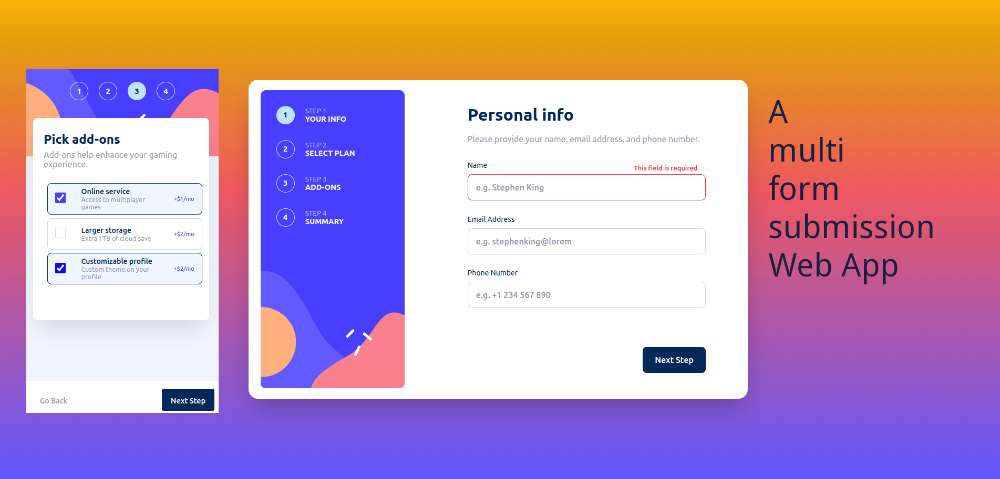

# Frontend Mentor - Multi-step form solution

This is a solution to the [Multi-step form challenge on Frontend Mentor](https://www.frontendmentor.io/challenges/multistep-form-YVAnSdqQBJ). 

## Table of contents

- [Overview](#overview)
  - [Screenshot](#screenshot)
  - [The challenge](#the-challenge)
  - [Links](#links)
- [My process](#my-process)
  - [Built with](#built-with)
  - [What I learned](#what-i-learned)
  - [Continued development](#continued-development)
  - [Useful resources](#useful-resources)
- [Author](#author)
- [Acknowledgments](#acknowledgments)

## Overview

### Screenshot



### The challenge

Users should be able to:

- Complete each step of the sequence
- Go back to a previous step to update their selections
- See a summary of their selections on the final step and confirm their order
- View the optimal layout for the interface depending on their device's screen size
- See hover and focus states for all interactive elements on the page
- Receive form validation messages if:
  - A field has been missed
  - The email address is not formatted correctly
  - A step is submitted, but no selection has been made


### Links

- Solution URL: [solution URL here](https://your-solution-url.com)
- Live Site URL: [Add live site URL here](https://your-live-site-url.com)

## My process

### Built with

- [vite](https://vitejs.dev/) -  build tool 
- [React](https://react.dev/) - JS library
- [React Router](https://reactrouter.com/) - React routing library
- [Typescript](https://www.typescriptlang.org/) - JS Superset
- [SCSS](https://sass-lang.com/) - CSS superset 
- Flexbox & Grid [[css-tricks](https://css-tricks.com/)]
- DevTools: [React Context](https://github.com/deeppatel234/react-context-devtool), [React DevTools](https://github.com/facebook)
- Browser: Brave(Version 1.64.113 Chromium: 123.0.6312.86 (Official Build) (64-bit)) and Google Chrome (Version 123.0.6312.86 (Official Build) (64-bit))
- git and github
- [figma](https://www.figma.com/)
- deploy: [Netlify](https://www.netlify.com/)
- desktop-first workflow

### What I learned

#### My Highlights
##### localStorage and useContext()
I decided to combine "localStorage" with the "useContext - Hook" for user input storage. Simply because 'till now I either worked with [JSON-Server](https://www.npmjs.com/package/json-server) or [MongoDB](https://www.mongodb.com/). Since I haven't used localStorage for a while now, I thought it'd be a great chance for this project. Then I added the useContext - Hook for sharing the input data between the routes and passing it either forward towards the finishing site, or for going back and updating data. You can look up the browser dev tools "application" for what has been stored inside Local storage. This also hepled me for dev - purposes, so that there's no need to uncommend the required fields of the first page when jumping back to it.
For the localStorage my idea was to store a the input of each route inside a key:value pair. As the snippet shows: 

I made the personInfo param optional, as it's not mandatory for the context inside this app, and since it's not relevant to be rendered on the finishing site. But as for planInfo and addon it's vice versa. What I also learned here: required parameters must come before optional parameters! 

The setItem - function basically says:     
         * take an item (input), planInfo, addon and personInfo.
         * store input in localStorage with a key that is either the personInfo, the planInfo or the addon,
         * which ever is not null or undefined.
         * If none of these values exist an error is thrown, because an item needs a key to be stored.
         * If there's an error an error message is logged to the console.
         * If everything went smoothly the item is stored in localStorage as a JSON string.

After submitting the chosen plan, you can clear the local storage with "onClick(()=>localStorage.clear())".

##### css and sass
I really enjoyed getting my styles done with [sass variables](https://sass-lang.com/documentation/variables/). 


#### Snippets

#### scss
```css
input[type="checkbox"]:not(:checked) {
        appearance: none;
        border: 1px solid $neutralLightGray;
    }

    label p:nth-child(1) {
        color: $primaryMarineBlue;
        font-weight: 500;
    }

    label p:nth-child(2) {
        color: $neutralCoolGray;
        font-weight: 400;
        font-size: 14px;
    }


    .price p {
        color: $primaryPurplishBlue;
        font-weight: 400;
        font-size: 0.9em;
    }
```

#### ts
```tsx
//localStorage and useContext 
export const StorageContext = React.createContext<StorageContextValue>([() => { }, () => { }]);

const StorageProvider: React.FC<{ children: React.ReactNode }> = ({ children }) => {
    const setItem = (item: string, planInfo: string, addon: string | null, personInfo?: string | null) => {
        try {
            if (!personInfo && !planInfo && !addon) {
                throw new Error("Must provide a storage key");
            }
            localStorage.setItem((personInfo || planInfo || addon)!, JSON.stringify(item));
        } catch (error) {
            console.error("Error setting localStorage item:", error);
        }
    };

    const getItem = (personInfo?: string, planInfo?: string, addon?: string) => {
        try {
            const item = localStorage.getItem((personInfo || planInfo || addon));
            return item ? JSON.parse(item) : null;
        } catch (error) {
            console.error("Error getting localStorage item:", error);
            return null;
        }
    };


    return (
        <StorageContext.Provider value={[setItem, getItem]}>
            {children}
        </StorageContext.Provider>
    );
};

//adding media query style with help of useLocation and ternary operator
function App() {

  const style = {

    // Adding media query..
    '@media (maxWidth: 375px)': {
      height: '100vh',
    },
  };

  const { pathname } = useLocation()

  const [addProps, setAddProps] = useState(false)
  const [height, setHeight] = useState(style)

  //helper function

  useEffect(() => {
    if (pathname === "/thank-you") {
      setAddProps(true)
    } else {
      setAddProps(false)
    }
  }, [pathname])


  return (
    <StorageProvider>
      <div className="App">
        <div className="frame_container"
          //if thank you page is active then set height to 100vh but only for mobile
          style={pathname === "/thank-you" && window.innerWidth < 768 ? { height: '100vh' } : height}
        >

    ...
    
```

### Continued development

Keep working on:

- the common React - Hooks
- maybe should handle forms with [react-hook-form](https://www.react-hook-form.com/get-started/#TypeScript)
- Typescript and the "proper" way of including it into React
- my css skills (using multiple classes in one html element, slectors...)
- unit testing with react-testing and Jest
- my clean code skills
- next projects workflow: maybe finish css first and then move on to react + ts.
- asking community for help

### Useful resources

- [geeks4geeks](https://www.geeksforgeeks.org/how-to-setup-404-page-in-react-routing/) - This helped me for handling a 404 - Page with react router. I really liked this pattern and will use it going forward.
- [w3schools - css toggle switch](https://www.w3schools.com/howto/howto_css_switch.asp)- This is an amazing article which helped me with the toggle switch. I'd recommend it to anyone.

## Author

- Website - [Portfolio](https://cipivlad.github.io/myportfoliosite/)
- Frontend Mentor - [@CipiVlad](https://www.frontendmentor.io/profile/yourusername)
- DEV.to - [https://dev.to/cipivlad](https://www.twitter.com/yourusername)

### Tags
- #react, #typescript, #scss, #vite, #github, #git, #form, #react-router, #jest
